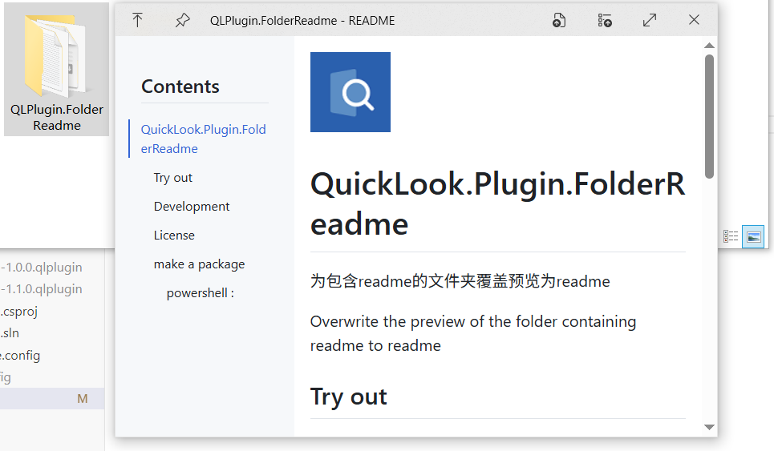

# QuickLook.Plugin.FolderReadme

为包含readme的文件夹覆盖预览为readme

Overwrite the preview of the folder containing readme to readme

## 使用效果

## License

MIT License.

## make a package

### powershell :

dotnet build -c Release ; .\pack-zip.ps1